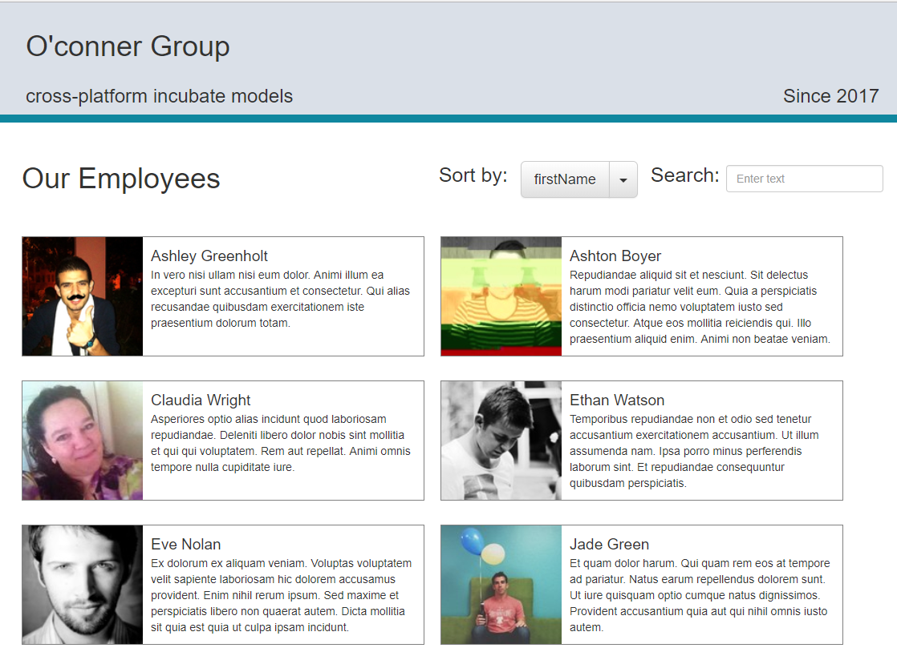
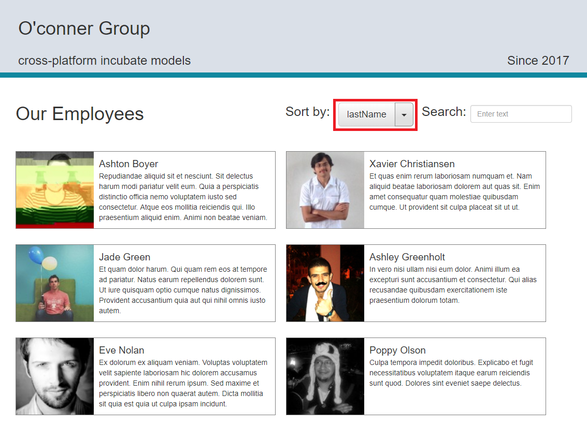
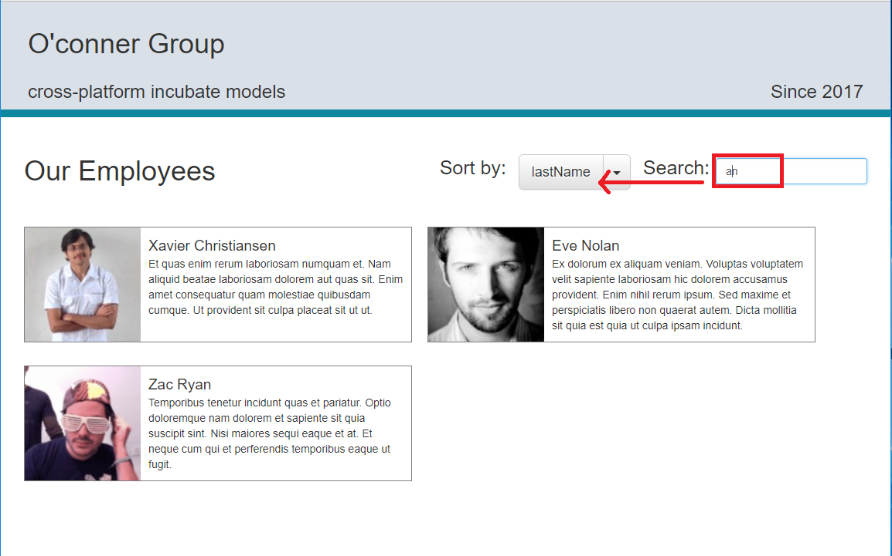
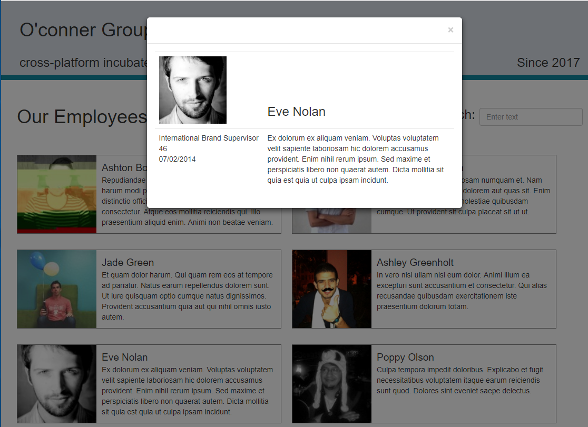
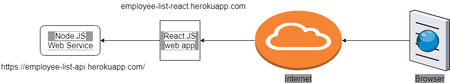
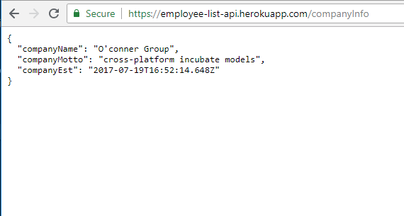
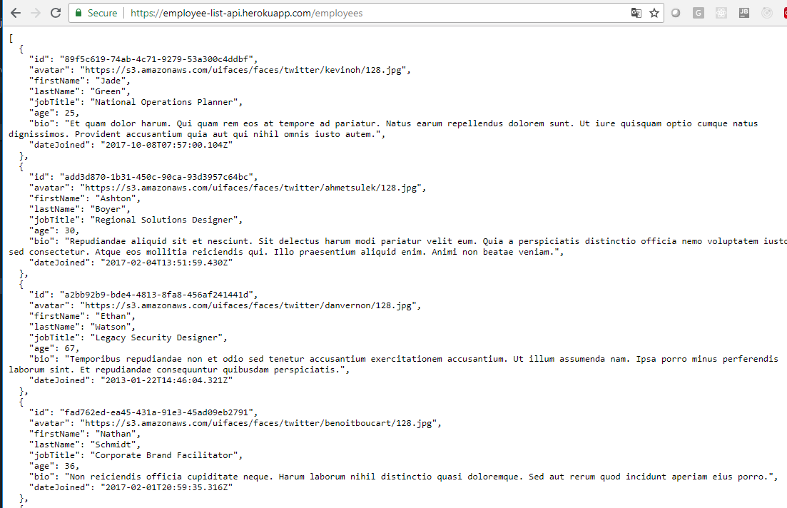

- [Welcome to my React + Redux + Redux-Thunk demo](#welcome-to-my-react---redux---redux-thunk-demo)
  * [Introduction](#introduction)
  * [Main Feature](#main-feature)
  * [Design diagram](#design-diagram)
  * [Run the application](#run-the-application)
    + [Run from the cloud](#run-from-the-cloud)
      - [Restful Web Server - https://employee-list-api.herokuapp.com/](#restful-web-server---https---employee-list-apiherokuappcom-)
      - [Front-end react app](#front-end-react-app)

<small><i><a href='http://ecotrust-canada.github.io/markdown-toc/'>Table of contents generated with markdown-toc</a></i></small>

# Welcome to my React + Redux + Redux-Thunk demo

## Introduction

## Main Feature

This is a sample employee list page, with sort and search features

The home page will show a list of employees

You can click the Sort by drop-down, to sort the list.

You can also search the employees based on the current sort by field. e,g the screen below will return all employees whose last name contains "an"

Click on one of the employee, will pop up the details of this employee.

## Design diagram

This web page contains two part:

 1. Front-end react.js app - React + Redux + Redux-Thunk
 2.  Restful web server - use [json-server](https://github.com/typicode/json-server) to fake a restful web server. Data is stored in json file (in a real production environment, it would be kept in a database)

See below shows the diagram.

## Run the application

### Run from the cloud

#### Restful Web Server - https://employee-list-api.herokuapp.com/

you can view the restful web service from browser

Click [/companyInfo](https://employee-list-api.herokuapp.com/companyInfo) will return a json object which contains company details

Click [/employees](https://employee-list-api.herokuapp.com/employees) will return a json object which contains employee list

#### Front-end react app 

I have published the site to heroku, which can be found on  [http://employee-list-react.herokuapp.com/](http://employee-list-react.herokuapp.com/)

I have also publised it on AWS S3, which can be found on  [http://employee-list-react.s3-website-ap-southeast-2.amazonaws.com](http://employee-list-react.s3-website-ap-southeast-2.amazonaws.com/)
